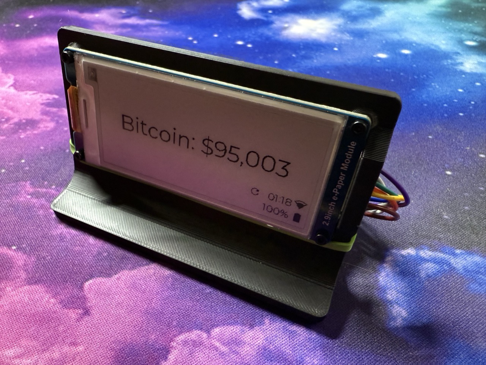

# Bitcoin Price 2.9" ePaper for ESPHome

[firebeetle2.yaml](firebeetle2.yaml) is an ESPHome configuration for a Firebeetle 2 ESP32-C6 to display the current Bitcoin price and system status on a Waveshare 2.9" black and white ePaper display. The configuration tells the Firebeetle2 to periodically wake up, update the display with sensor data, then go back to deep sleep.



## Firebeetle2 ESP32-C6
This is a great device for ESPHome. It's widely available, has Wifi6, deep sleep and costs only £8 / $10. As an ESP32-C6 device, the Firebeetle2 not widely supported by ESPHome, yet. My configuration shows how to get it working, at least for now. (Note, there are other Firebeetle2 devices that are not the C6 chip).

## Features

- **Bitcoin Price Display**: Fetches and displays the current Bitcoin price from the public Coingecko API, via a Home Assistant entity
- **Status Monitoring**: Monitors and displays the battery percentage and wifi signal on-screen with icons.
- **Deep Sleep for long battery life**: The device wakes up every 60 minutes, gets the current Bitcoin price, updates the ePaper screen, then goes back to sleep. My device is only awake about 8 seconds each hour.

## Hardware Installation

### Controller: Firebeetle2 ESP32-C6

Purchase: Around £8 at AliExpress: https://vi.aliexpress.com/item/1005006449798923.html

Notes:
Connect the Firebeetle2 to the ePaper as listed in the YAML. Something like...

(Waveshare ePaper board connector label >> wire colour >> Firebeetle2 pin >> YAML label)
1. BUSY >> Purple >> 3 >> busy_pin
2. RST >> White >> 2 >> reset_pin
3. DC >> Green >> 1 >> dc_pin
4. CS >> Orange >> 7 >> cs_pin
5. CLK >> Yellow >> 4 >> clk_pin
6. DIN >> Blue >> 6 >> mosi_pin
7. GND >> Brown >> G >> not mentioned
8. VCC >> Grey >> 3.3 >> not mentioned

The onboard LED does not light up except when the device is charging the battery, presumably to save power

### Display: Waveshare 2.9" black and white display. 

Purchase: £22 at Amazon UK: https://amzn.eu/d/aKlZQN6

Notes: The project could be modified for other displays, but:
1) Waveshare ePaper seems to work more reliably and is better supported than cheaper 3rd party ePaper
2) Don't be tempted by a black/white/red display. They take around 20 seconds to refresh the display, which is too long.

The display comes with a cable from the ePaper to Dupoint wires for connecting to the Firebeetle2.

### Battery

Purchase: £8 for this EEMB battery from Amazon UK: https://amzn.eu/d/aDqnDVv

Notes: Lipo 2000mah battery. Buy one with built-in protection against overcharging or rapid discharge etc. 

### Stand

3D printed from https://www.printables.com/model/266626-waveshare-29-inch-e-ink-screen-stand

## Software Installation

1. Create a Bitcoin entity to track the Bitcoin price in Home Assistant. In /homeassistant/configuration.yaml, add:

```
sensor:
  # Bitcoin Current Price (USD)
  - platform: rest
    name: Bitcoin Current Price
    unique_id: bitcoin_current_price
    resource: https://api.coingecko.com/api/v3/simple/price?ids=bitcoin&vs_currencies=usd
    value_template: "{{ value_json.bitcoin.usd }}"
    unit_of_measurement: "USD"
    scan_interval: 3600  # Update once per hour
```
2. HA > Settings > Devices & Services > Helpers > Create Helper >> Toggle. Name it "firebeetle_enable_sleep" for a new entity called "input_boolean.firebeetle_enable_sleep", to match what's in the YAML When this setting is off, the Firebeetle2 will remain awake and ready for OTA updates and monitoring. When it's on (either immediately when turned on, or on when the device boots), the device will sleep as configured.

3. **Compile and Upload**: Use the ESPHome dashboard to compile and upload the configuration in the YAML "firebeetle2.yaml" to your Firebeetle2.